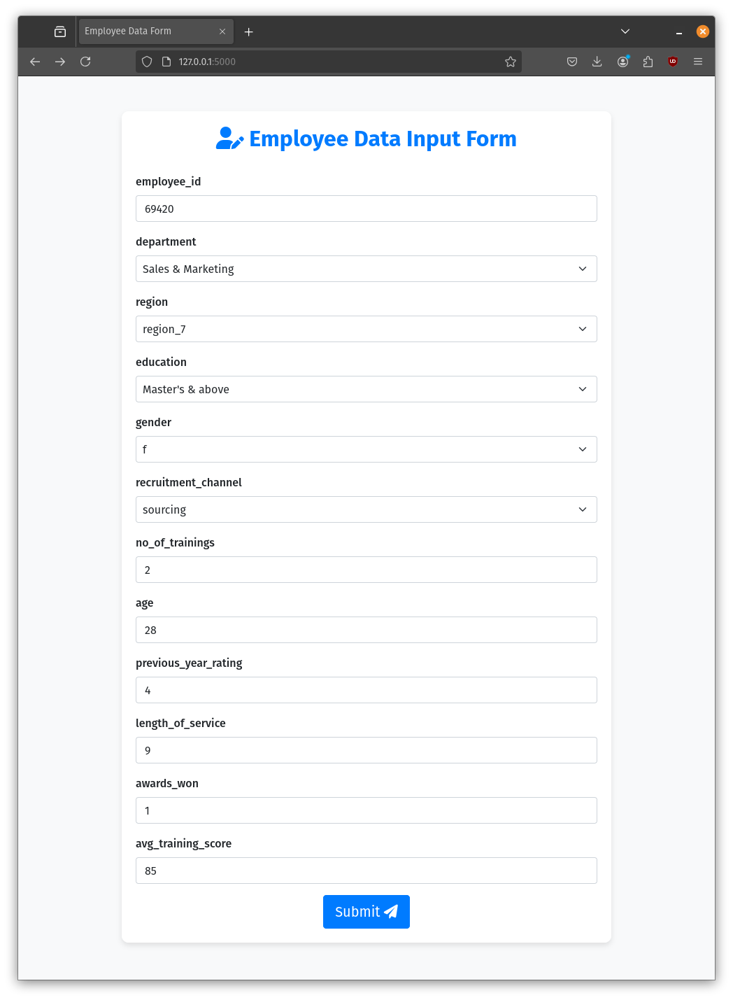
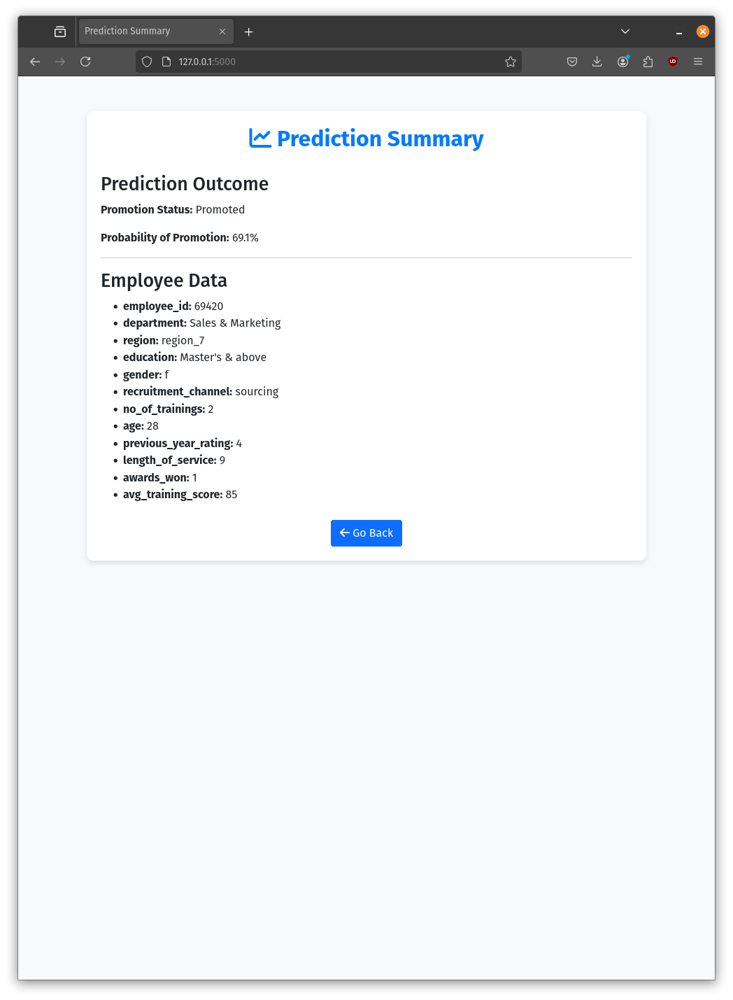

# Employee Performance Appraisal System

A machine learning-based system for analyzing and predicting employee promotions.

## Features

- Upload employee data via CSV file
- Intuitive employee selection interface
- Machine learning-based promotion prediction
- Searchable results history
- Secure database storage of employee data and analysis results

## Showcase

### Data Input Interface


### Analysis Results


## Setup

1. Clone the repository:
```bash
git clone https://github.com/ifhoncho/CS485-employee-performance-appraisal.git
cd CS485-employee-performance-appraisal
```

2. Install required packages:
```bash
pip install -r requirements.txt
```

Required packages and versions:
- Flask==2.1.1
- pandas==1.4.2
- joblib==1.1.0
- scikit-learn==1.0.2
- numpy==1.21.6
- imblearn==0.0
- Werkzeug==2.1.1
- mysql-connector-python==8.0.33
- python-dotenv==1.0.0

3. Set up environment variables:
   - Copy the template file:
     ```bash
     cp employee_eval/.env.template employee_eval/.env
     ```
   - Edit the `employee_eval/.env` file with your database credentials:
     ```
     DB_HOST=localhost
     DB_PORT=3306
     DB_USER=your_username
     DB_PASSWORD=your_password
     DB_NAME=your_database_name
     DB_CHARSET=utf8mb4
     ```

## Running the Application

1. Start the Flask application:
```bash
python3 employee_eval/employee_eval.py
```

2. Access the application in your web browser at:
```
http://127.0.0.1:5000
```

## Using the Application

1. **Upload Employee Data**
   - Click "Choose File" to select your CSV file
   - The CSV should match the format of the sample data provided in `employee_eval/sample_data.csv`
   - Click "Upload" to process the file

2. **Select and Analyze Employees**
   - Use the search box to filter employees
   - Select individual employees or use "Select All"
   - Click "Analyze Selected" to generate predictions

3. **View Results**
   - Click "View All Analysis Results" to see the complete history
   - Use the search functionality to filter results
   - Results show prediction status and promotion probability

## CSV Format

The input CSV file must contain the following columns:
- employee_id (unique identifier)
- department (e.g., Sales & Marketing, Technology, Operations)
- region (e.g., region_1, region_2)
- education (Bachelor's, Master's & above)
- gender (m/f)
- recruitment_channel (sourcing/other)
- no_of_trainings (numeric)
- age (numeric)
- previous_year_rating (1-5)
- length_of_service (numeric)
- awards_won (0/1)
- avg_training_score (numeric)
- is_promoted (0/1)

Note: Some fields may be empty in the CSV, but the column headers must be present.

## Database Setup

This application connects to a shared development MySQL database. No local database setup is required. Instead:
1. Contact Jack to obtain the necessary database credentials (hostname and password)
2. Use these credentials in your .env file
3. The database and required tables are already configured and ready to use

## Security Note

- Never commit the `.env` file containing your database credentials. The `.gitignore` is set accordingly to prevent this; omething to be aware of nonetheless.

## License

This project is released under [The Unlicense](https://unlicense.org/), which means it is dedicated to the public domain. Anyone is free to copy, modify, publish, use, compile, sell, or distribute this software, either in source code form or as a compiled binary, for any purpose, commercial or non-commercial, and by any means, without any conditions or restrictions.

The software is provided "as is", without warranty of any kind. For more details, see the [LICENSE](LICENSE) file in the repository.
