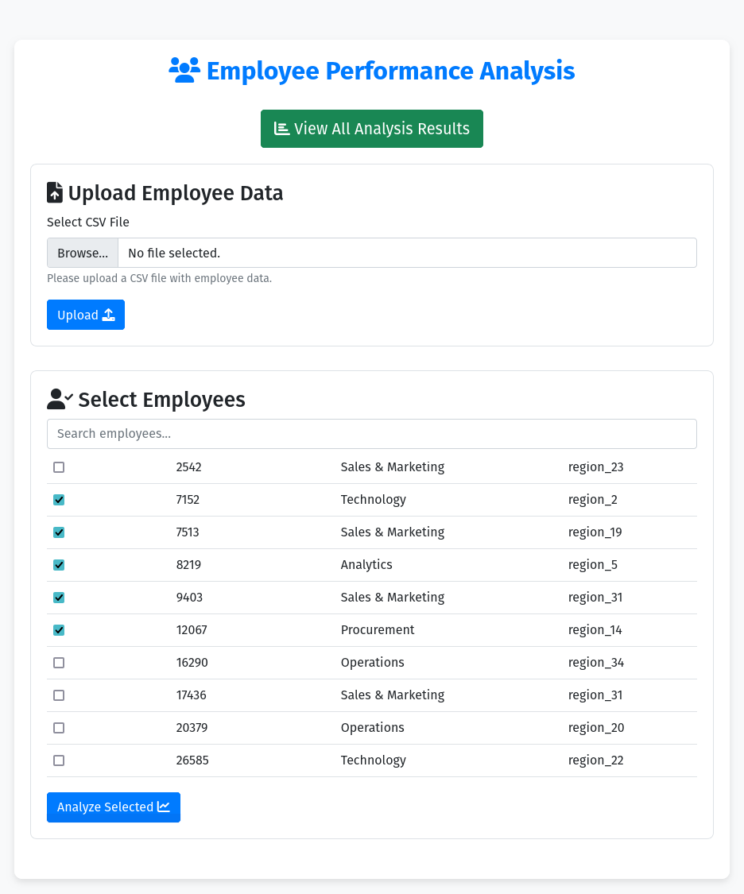
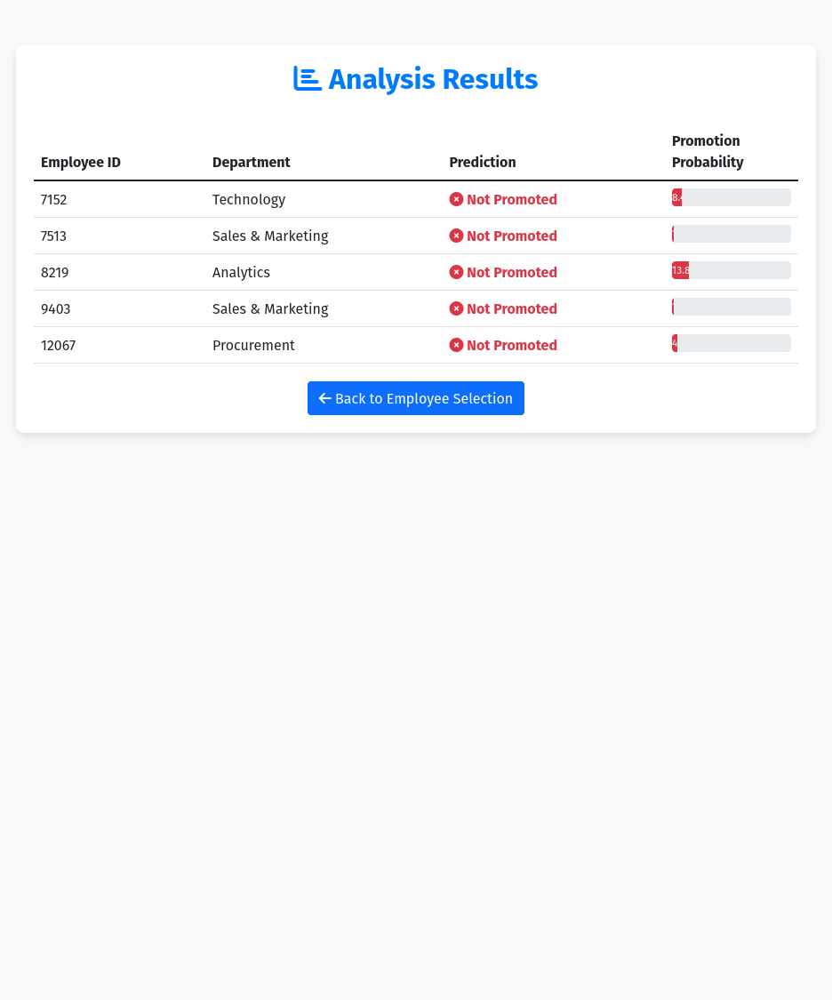

# Employee Performance Evaluation & Appraisal Using Machine Learning

## Overview

This proof of concept (PoC) demonstrates an Employee Performance Evaluation & Appraisal System using Machine Learning, specifically the RandomForest algorithm. The system analyzes employee performance metrics and automates the appraisal process, allowing managers to enter data and receive performance predictions via a web portal. Results are visualized through CSV or Excel reports, enabling data-driven decision-making for managers and HR teams.

## Table of Contents

1. Overview
2. Features
3. System Architecture
4. Technologies Used
5. Showcase Images
6. Running the Application

## Features

- **Employee Performance Prediction**: Predict performance using a RandomForest model trained on labeled employee data.
- **Performance Evaluation**: Automatically calculate appraisal scores based on employee metrics.
- **Interactive Web Portal**: Managers can input data and view AI predictions regarding employee performance.
- **Report Generation**: Export appraisal results into CSV/Excel for further analysis.
- **User-Friendly Interface**: Simple web-based UI for easy model interaction.

## System Architecture

The system includes:

- **Frontend**: A web interface for data input, model interaction, and performance visualization.
- **Backend**: Processes employee data, trains the RandomForest model, and generates predictions.
- **Database**: MySQL database for storing employee data, metrics, and results.
- **Machine Learning Module**: Uses RandomForest for performance analysis and prediction.

## Infrastructure

- **Database**: MySQL (hosted locally or in the cloud)
- **Compute Server**: Python environment (can be hosted on HPC or cloud)
- **Web Interface**: Flask/Django-based backend with user interaction features

## Technologies Used

- **Python**: Data processing and machine learning.
- **Flask/Django**: Backend API and web framework.
- **Pandas**: Data manipulation.
- **Scikit-learn**: RandomForest implementation.
- **MySQL**: Relational database.
- **HTML/CSS/JavaScript**: Web interface components.

### Sample CSV Structure

| Employee_ID | Department | Region | Education | Gender | Recruitment_Channel | Num_Trainings | Age | Previous_Year_Rating | Length_of_Service | Awards_Won | Avg_Training_Score | Promotion_Status |
|-------------|------------|--------|-----------|--------|---------------------|---------------|-----|----------------------|-------------------|------------|--------------------|------------------|
| 001         | Sales      | North  | Bachelor  | Male   | Agency              | 3             | 30  | 4                    | 5                 | 1          | 80                 | 0                |
| 002         | IT         | East   | Master    | Female | Sourcing            | 2             | 28  | 3                    | 4                 | 0          | 70                 | 1                |

## Proof of Concept

### Input Page



### Prediction Summary Page



## Running the Application

Follow these steps to set up and run the application:

1. **Clone the Repository**:
   ```bash
   git clone <repository_url>
   cd CS485-employee-performance-appraisal/
   ```

2. **Create a Virtual Environment**:
   Ensure Python 3, pip, and a virtual environment are installed on your machine:
   - Create the virtual environment:
     ```bash
     python3 -m venv .venv
     ```
   - Activate the virtual environment:
     ```bash
     source .venv/bin/activate  # On macOS/Linux
     .venv\Scripts\activate      # On Windows
     ```
   - Install dependencies:
     ```bash
     pip install -r requirements.txt
     ```

3. **Set the FLASK_APP Environment Variable**:
   To run the application, you need to specify the location of the Flask app:
   
   - For macOS/Linux:
     ```bash
     export FLASK_APP=employee_eval/employee_eval.py
     ```
   
   - For Windows (Command Prompt):
     ```cmd
     set FLASK_APP=employee_eval/employee_eval.py
     ```

   - For Windows (PowerShell):
     ```powershell
     $env:FLASK_APP="employee_eval/employee_eval.py"
     ```

4. **Run the Flask App**:
   Start the Flask application:
   ```bash
   flask run
   ```

5. **Access the Application**:
   Open a web browser and navigate to `http://127.0.0.1:5000/` to view the employee data input form.